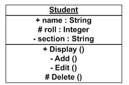
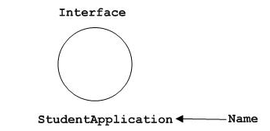
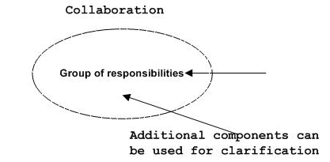
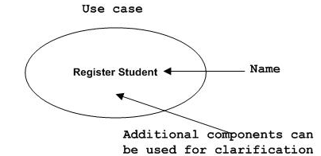
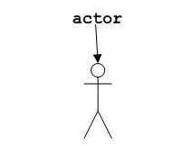
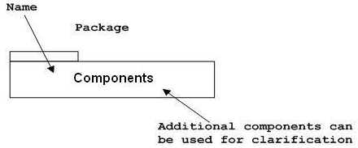
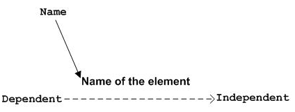

# UML基本表示法

UML 是流行的图解符号。我们都知道，UML 是可视化，说明，构建和记录软件和非软件系统的组成部分。这里的可视化是最重要的部分，需要被理解和记忆。

UML 符号是最重要的建模元素。适当有效地使用符号是非常重要的一个完整的，有意义的模型。该模型是无用的，除非它的目的是正确描绘。

所以学习符号应该从一开始就强调。不同的符号可用于事物和关系。 UML 图使用的符号物件和关系。可扩展性是另一个重要的功能，这使得 UML 更加强大和灵活。

## 结构事物:

图形表示法中使用的结构事物是 UML 中最广泛使用的，这些被认为是为 UML 模型的名词。以下是结构事物的列表。

- 类
- 接口
- 协作
- 用例
- 活动类
- 组件
- 节点

### 类注释:

下面的图表示的 UML 类，该图被分为四个部分。

- 顶端部分被用来命名类。
- 第二个是用来显示类的属性。
- 第三部分是用来描述由类执行的操作。
- 第四部分是可选的显示附加组件。

类是用来表示对象，对象可以是任何性质和职责。

### 对象表示法:

该对象表示以同样的方式作为类。唯一的区别是有下划线的名称，如下图所示。

由于对象是实际执行的一类被称为类的实例。因此，它具有相同的使用作为类。

### 接口表示法:

接口是用圆来表示，如下所示。它有一个名称，一般写成下面的圆圈。

接口是用来描述的功能，而不执行。界面就像一个模板，定义不同的功能但不执行。当一个类实现了接口，也按要求实现功能。

### 协作表示法:

协作表示由 eclipse 虚线如下所示。它有一个名字，里面写 eclipse。 

协作表示职责，一般职责在一组。

### 用例表示法:

用例表示它里面的一个名字作为 eclipse。它可能包含更多的责任。

用例是用来捕捉系统的高层次功能。

### 角色表示法:

某些内部或外部的与系统进行交互的实体，可以被定义为一个角色。

角色是在描述用例图内部或外部实体。

### 初始状态表示法：

初始状态被定义，以显示开始的一个过程。这个符号存在于大多数图。

初始状态的表示法的用法是显示一个过程的起点。

### 最终状态表示法：

最终状态是用来显示的一个过程的结束。这种表示法也可以用来在大部分的图中描述的目的。

最终状态表示法的用法是显示一个过程的终止点。

### 活动类表示法：

活动类类似于一类具有扎实的边界，活动类一般是用来描述一个系统的并发行为。

活动类是用来表示一个系统的并发性。

### 元件表示法：

UML 中的一个组件，如下图所示名称里面。在必要时，可以添加额外的元素。

元器件是用来表示系统的任何部分的 UML 图。

### 节点表示法：

UML 中的一个节点表示的一个方盒子，如下图所示，同一个名字。一个节点表示一个物理的系统组件。

节点用来表示物理系统的一部分，如服务器，网络等。

## 行为事物：

动态部分是 UML 中最重要的元素之一。 

UML 有一个强大的功能集，代表软件和非软件系统的动态部分。这些功能包括交互和状态机。

相互作用可分为两种类型：

- 顺序（序列图）
- 协作（协作图）

### 交互表示法：

交互基本上是两个 UML 组件之间的信息交换。下图表示交互中使用不同的符号。

交互是用来表示一个系统的组件之间的通信。

### 状态机表示法：

状态机描述的组件在其生命周期的不同状态。在下面的图中描述的符号。

状态机是用来描述一个系统组件的不同状态。状态可以是活动，空闲或任何其他根据情况。

## 分组事物：

组织的 UML 模型设计的最重要的方面之一。 UML 中只有一个元件即可用于分组，也就是包。

### 包表示法:

包装信息书写方式如下表所示，这是用来包装系统组成部分的。

## 注释事物：

任一图表中说明的不同的元素和它们的功能是非常重要的。因此，UML 符号注释，以支持这一要求。

### 注释表示法:

这种表示法如下所示，它们被用来提供一个系统的必要的信息。

## UML 关系

模型是不完整的，正确的描述，除非元素之间的关系。关系给出了一个 UML 模型的意思。

以下是 UML 中提供的不同类型的关系：

- Dependency
- Association
- Generalization
- Extensibility

### 依赖表示法：

依赖是UML元素的一个重要方面。它描述了相关的元素和方向上依赖关系。

依赖关系的虚线箭头表示，如下所示。箭头代表的独立元素，另一端的依赖元素。

依赖关系是用来表示一个系统的两个元素之间的依赖。

### 协作表示法：

协作介绍 UML 图中的元素相关联。简单的一句话，它介绍了多少个元素参与互动。

联合会（无）两侧的箭头的虚线表示。两端代表两个相关联的元素，如下所示。在两端（1，*等）的多样性也提到多少对象相关。

协作是用来表示一个系统的两个元素之间的关系。

### 泛化表示法：

泛化介绍了面向对象世界的继承关系。这是父与子的关系。

泛化为代表的空心箭头，如下图所示箭头的一端表示的父元素而另一端表示子元素。

泛化是用来描述一个系统的两个元素的亲子关系。

### 可扩展性表示法:

所有的语言（编程或模型）有某种机制来扩展与其功能类似的语法，语义等。 UML 具有以下机制来提供可扩展性功能。

- 定型观念(代表新元素)
- 标记值 (代表新的属性)
- 约束 (代表界限)

可扩展标记基本上是用来表示一些额外的系统行为的附加元素。这些额外的行为，不包括可用的标准符号。