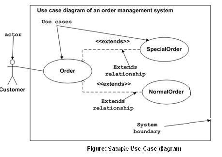

# UML用例图介绍

## UML 用例图概述:

用例图捕捉了模拟系统中的动态行为，并且描述了用户、需求以及系统功能单元之间的关系。

用例图展示了一个外部用户能够观察到的系统功能模型图。

用例图由主角，用例和它们之间的关系组成。

## UML 用例图的目的:

用例图的目的是捕捉到一个系统的动态方面。

用例图是用来收集系统的要求，包括内部和外部的影响。这些要求大多是设计要求。所以，分析一个系统时要收集其功能用例和确定参与者。

简单来说，用例图的目的如下：

- 用例图用来收集系统的要求。
- 用例图用于获取系统的外观图。
- 用例图识别外部和内部因素影响系统。
- 用例图显示要求之间的相互作用是参与者。

## 如何画用例图？

用例图被认为是高层次的需求分析系统。因此，当系统的要求，分析被捕获在用例的功能。

因此，我们可以说，使用情况是什么，但在一个有组织的方式编写的系统功能。现在到用例相关的第二件事情是参与者。行为者可以被定义为与系统进行交互的东西。

参与者可以是人的用户，一些内部的应用程序，或可能会有一些外部应用程序。因此，在一个简短的，当我们正计划绘制一个用例图中应该有以下项目:

- 功能被表示为一个用例
- 参与者
- 用例和参与者之间的关系。

绘制到用例图捕获系统的功能要求。因此，确定上述项目后，我们必须遵循以下指导原则，绘制一个有效的用例图。

- 一个用例的名称是非常重要的。所以名的选择应以这样的方式，以便它可以识别执行的功能。
- 给出一个合适的名参与者。
- 图中清楚地显示关系和依赖性。
- 不要试图包括所有类型的关系。由于该图的主要目的是确定要求。
- 使用注意以往任何时候都需要阐明一些重要的点。

下面是一个示例用例图，代表订单管理系统。因此，如果我们看看图，那么我们会发现三个用例（订单，特殊订单和正常订单）和一个参与者：顾客。

SpecialOrder 和*NormalOrder* 从订单使用情况扩展。因此，他们扩展了关系。另外很重要的一点是确定系统边界，这是图中所示。参与者是客户以外的系统，因为它是系统的外部用户。

## 用例图怎么使用？

要了解一个系统的动态，我们需要使用不同类型的图表。用例图就是其中之一，其具体目的是收集系统的的需求和参与者。

用例图指定系统的事件和他们的流向。但从未用例图描述了他们是如何实现的。可以被想象成一个黑盒子，只有输入，输出和黑盒子的功能被称为用例图。

在这些图中使用的设计在一个非常高的水平。那么这种高层次的设计高雅，一遍又一遍完善使系统得到一个完整实用的图片。一个结构良好的用例，还介绍了前置条件，后置条件和例外。而这些多余的元素在执行测试时被用来制造测试的情况下。

用例都不是正向和反向工程，但他们仍然使用略有不同的方式。同样是真实的逆向工程。仍用例图的使用方式不同，使其逆向工程的一个候选。

在正向工程用例图是用来做测试案例和逆向工程中的使用情况下是用来准备从现有的应用程序的需求细节。

所以下面的地方使用用例图：

- 需求分析和高水平的设计。
- 模拟系统的上下文。
- 逆向工程。
- Forward engineering.